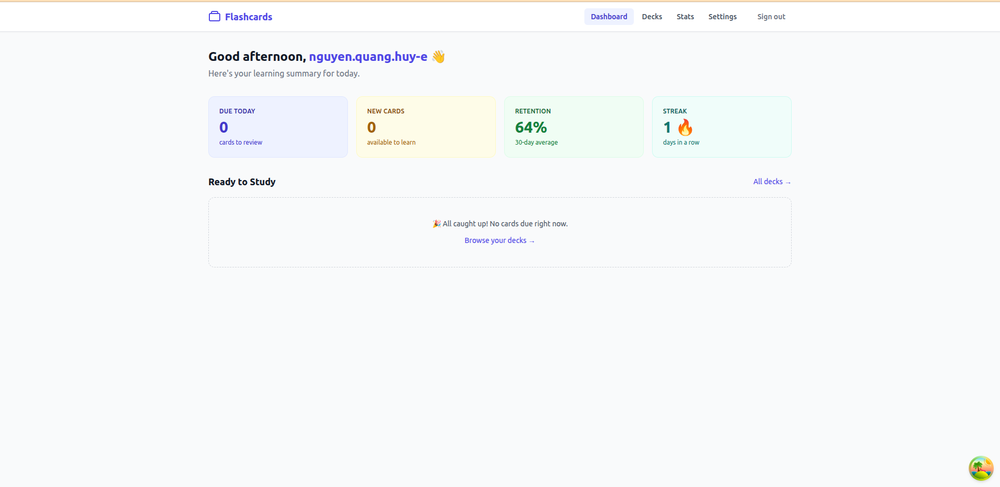
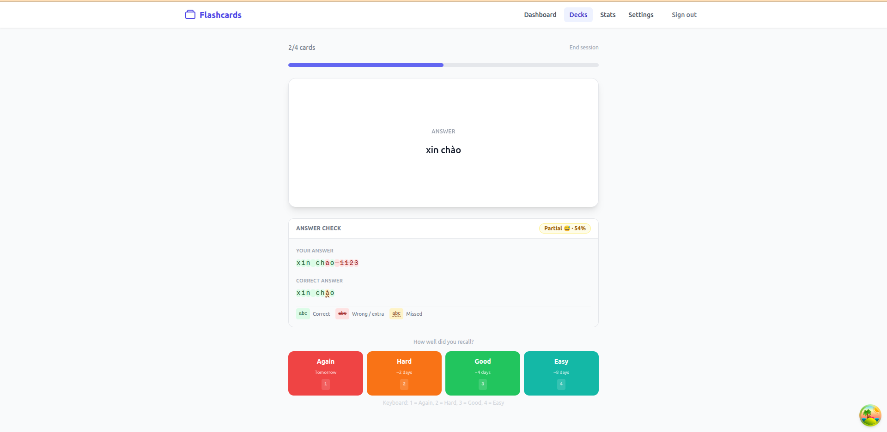
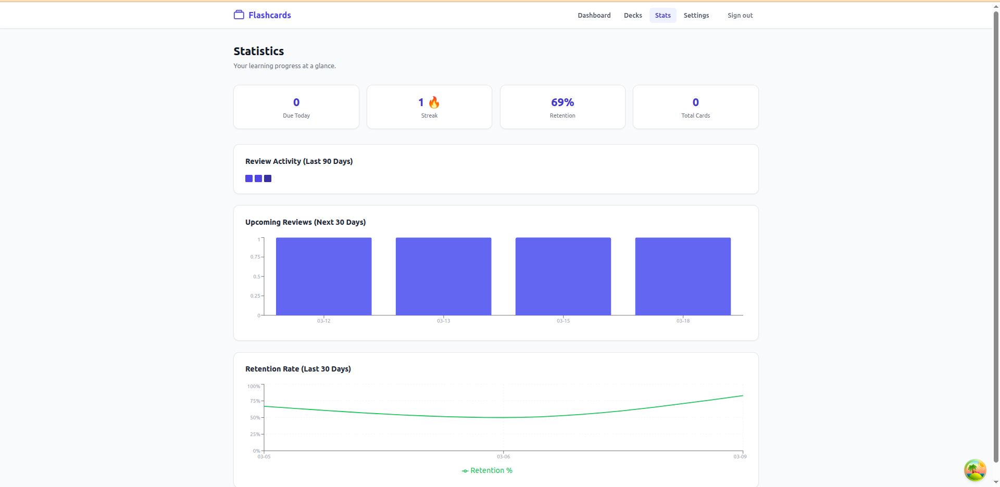
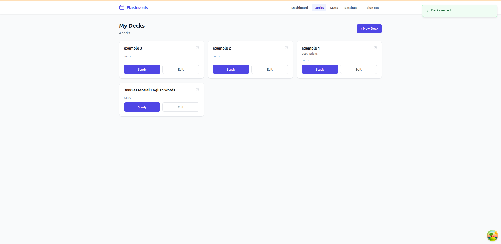
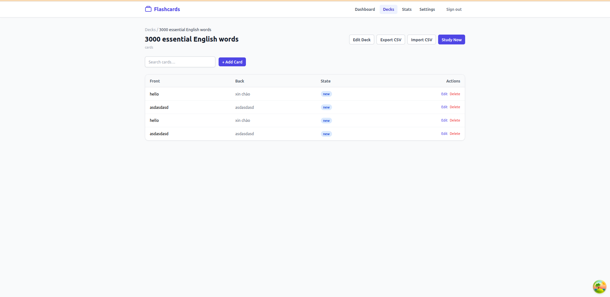
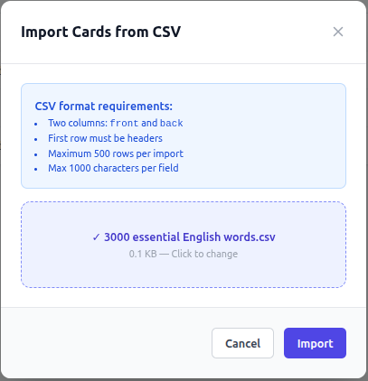

# 🃏 Flashcards SRS

A full-stack **Spaced Repetition System (SRS)** flashcard application built with Node.js, React, and PostgreSQL. Study smarter — not harder — using the SM-2 algorithm to schedule card reviews at optimal intervals.

---

## 📸 Screenshots

> Place screenshots in `docs/screenshots/` and update paths below.

| Dashboard | Study Session | Statistics |
|:---------:|:-------------:|:----------:|
|  |  |  |

| Deck List | Card Management | Bulk Import |
|:---------:|:---------------:|:-----------:|
|  |  |  |

---

## ✨ Features

- 🔐 **Authentication** — JWT-based register/login with access + refresh tokens
- 📚 **Deck & Card Management** — Create, edit, delete decks and cards
- 🧠 **SM-2 Algorithm** — Automatic scheduling with interval, ease factor, and fuzz
- 📊 **Statistics & Heatmap** — Retention rate, study streak, activity calendar
- 📥 **Bulk CSV Import** — Import up to 500 cards at once from a CSV file
- 🔔 **Daily Reminders** — Email/push notifications when cards are due
- 📱 **Responsive UI** — Tailwind CSS, works on mobile and desktop

---

## 🏗️ Architecture

```
┌─────────────────────────────────────────────────────────────┐
│                        Browser                              │
│                React + TanStack Query + Tailwind            │
└─────────────────────────┬───────────────────────────────────┘
                          │ HTTP (Caddy reverse proxy)
┌─────────────────────────▼───────────────────────────────────┐
│                    Express API  :3001                        │
│    Auth · Decks · Cards · Sessions · Stats · Settings       │
└─────────────────────────┬───────────────────────────────────┘
                          │ Prisma ORM
┌─────────────────────────▼───────────────────────────────────┐
│                   PostgreSQL 16                              │
│  users · decks · cards · card_progress · study_sessions     │
│  session_queue · review_logs · user_settings                │
└─────────────────────────────────────────────────────────────┘
```

### Tech Stack

| Layer | Technology |
|-------|-----------|
| Frontend | React 18, TypeScript, Vite, TanStack Query, React Router v6, Tailwind CSS, Recharts |
| Backend | Node.js 22, Express, TypeScript, Prisma ORM |
| Database | PostgreSQL 16 |
| Auth | JWT (access 15m + refresh 7d), bcrypt |
| Testing | Vitest (unit + integration), Playwright (E2E) |
| CI/CD | GitHub Actions |
| Containerisation | Docker, Docker Compose, Caddy |

---

## 📐 Data Model

```
User ──< Deck ──< Card ──< CardProgress
  │              │
  │              └──< SessionQueue
  │
  └──< StudySession ──< ReviewLog
```

| Model | Description |
|-------|-------------|
| `User` | Account with email + hashed password |
| `Deck` | Named collection of cards belonging to one user |
| `Card` | Front/back flashcard within a deck |
| `CardProgress` | Per-user SRS state: interval, ease factor, due date, state |
| `StudySession` | A single study run with status `active/completed/abandoned` |
| `SessionQueue` | Snapshot of cards to study in a session (ordered) |
| `ReviewLog` | Immutable log of every rating event |
| `UserSettings` | Daily limits, timezone, reminder preferences |

---

## 🚀 Quick Start

### Prerequisites

- [Docker](https://docs.docker.com/get-docker/) & Docker Compose
- Node.js 22+ (for local development)

### Run with Docker (recommended)

```bash
# 1. Clone the repo
git clone <repo-url>
cd Flashcards

# 2. (Optional) Set secrets — defaults work for local dev
export JWT_SECRET=your_secret_here
export JWT_REFRESH_SECRET=your_refresh_secret_here

# 3. Start all services
docker compose up --build

# 4. Open in browser
open http://localhost
```

The app will be available at **http://localhost** (Caddy proxy → React frontend → Express API → PostgreSQL).

### Local Development

```bash
# Install all dependencies
npm install

# Start PostgreSQL
docker compose up postgres -d

# --- Backend ---
cd backend
cp .env.example .env          # edit DATABASE_URL, JWT_SECRET, etc.
npm run db:generate            # generate Prisma client
npm run db:migrate             # apply migrations
npm run db:seed                # seed demo users (optional)
npm run dev                    # start API at :3001 with hot-reload

# --- Frontend (separate terminal) ---
cd frontend
npm run dev                    # start Vite dev server at :5173
```

#### Demo Accounts (after seeding)

| Email | Password |
|-------|----------|
| `alice@test.com` | `password123` |
| `bob@test.com` | `password123` |

---

## 🔌 API Reference

**Base URL**: `http://localhost:3001/api/v1`  
**Auth**: `Authorization: Bearer <accessToken>`

### Authentication

| Method | Endpoint | Description | Auth |
|--------|----------|-------------|------|
| `POST` | `/auth/register` | Create account | ❌ |
| `POST` | `/auth/login` | Get tokens | ❌ |
| `POST` | `/auth/refresh` | Refresh access token | ❌ |
| `POST` | `/auth/logout` | Invalidate (client-side) | ❌ |

### Decks

| Method | Endpoint | Description | Auth |
|--------|----------|-------------|------|
| `GET` | `/decks` | List user's decks | ✅ |
| `POST` | `/decks` | Create deck | ✅ |
| `GET` | `/decks/:id` | Get deck | ✅ |
| `PATCH` | `/decks/:id` | Update deck | ✅ |
| `DELETE` | `/decks/:id` | Delete deck | ✅ |
| `GET` | `/decks/:id/cards` | List cards in deck | ✅ |
| `POST` | `/decks/:id/cards` | Create card | ✅ |
| `POST` | `/decks/:id/import` | Bulk CSV import | ✅ |

### Study Sessions

| Method | Endpoint | Description | Auth |
|--------|----------|-------------|------|
| `POST` | `/sessions` | Start a session | ✅ |
| `GET` | `/sessions/:id/next-card` | Get next card (front only) | ✅ |
| `POST` | `/sessions/:id/rate` | Rate a card | ✅ |
| `POST` | `/sessions/:id/complete` | Complete session | ✅ |
| `POST` | `/sessions/:id/abandon` | Abandon session | ✅ |
| `GET` | `/sessions/:id/summary` | Session summary | ✅ |

### Statistics

| Method | Endpoint | Description | Auth |
|--------|----------|-------------|------|
| `GET` | `/stats/dashboard` | Due count, streak, retention | ✅ |
| `GET` | `/stats/heatmap?days=90` | Activity heatmap data | ✅ |
| `GET` | `/stats/deck/:id` | Per-deck card state breakdown | ✅ |

### Settings

| Method | Endpoint | Description | Auth |
|--------|----------|-------------|------|
| `GET` | `/settings` | Get user settings | ✅ |
| `PATCH` | `/settings` | Update settings | ✅ |

---

## 🧠 SM-2 Algorithm

Cards move through four states based on ratings:

```
new ──(Good/Easy)──► learning ──(Good/Easy)──► review
 │                                                │
 └──(Again)──► relearning ◄──────(Again)─────────┘
```

| Rating | Effect |
|--------|--------|
| **Again** | `interval = 1`, `ease -= 0.20` (min 1.3), → `relearning` |
| **Hard** | `interval × 1.2`, `ease -= 0.15` |
| **Good** | `interval × ease_factor` |
| **Easy** | `interval × ease × 1.3`, `ease += 0.15` (max 2.5) |

Intervals ≥ 8 days receive a random **fuzz** of ±15% to prevent cards clustering on the same day.

---

## 🧪 Testing

```bash
# Backend unit + integration tests
cd backend
npm test

# Backend with coverage
npm run test:coverage

# Frontend E2E (requires running app)
cd frontend
npm run test:e2e

# Frontend E2E with UI
npm run test:e2e:ui
```

### Test Coverage

| Suite | Files | Tests |
|-------|-------|-------|
| SM-2 unit tests | `src/lib/srs/sm2.test.ts` | 21 |
| Session integration | `tests/integration/sessions.integration.test.ts` | 8 |
| E2E (Playwright) | `tests/e2e/*.spec.ts` | ~50 |

---

## ⚙️ Environment Variables

### Backend (`backend/.env`)

| Variable | Required | Default | Description |
|----------|----------|---------|-------------|
| `DATABASE_URL` | ✅ | — | PostgreSQL connection string |
| `JWT_SECRET` | ✅ | — | Access token signing secret |
| `JWT_REFRESH_SECRET` | ✅ | — | Refresh token signing secret |
| `JWT_ACCESS_EXPIRES_IN` | ❌ | `15m` | Access token TTL |
| `JWT_REFRESH_EXPIRES_IN` | ❌ | `7d` | Refresh token TTL |
| `PORT` | ❌ | `3001` | API server port |
| `NODE_ENV` | ❌ | `development` | `development` / `production` / `test` |
| `CORS_ORIGIN` | ❌ | `*` | Allowed CORS origin |

### Frontend (`frontend/.env`)

| Variable | Required | Default | Description |
|----------|----------|---------|-------------|
| `VITE_API_BASE_URL` | ❌ | `/api/v1` | Backend API base URL |

---

## 🗂️ Project Structure

```
Flashcards/
├── backend/
│   ├── src/
│   │   ├── api/            # Route handlers & services
│   │   │   ├── auth/
│   │   │   ├── decks/
│   │   │   ├── sessions/
│   │   │   ├── stats/
│   │   │   └── settings/
│   │   ├── lib/
│   │   │   ├── srs/        # SM-2 algorithm + queue builder
│   │   │   └── notifications/
│   │   ├── middleware/     # auth, ownership, errorHandler
│   │   └── prisma/         # schema + migrations + seed
│   └── tests/
│       └── integration/
├── frontend/
│   └── src/
│       ├── components/     # Reusable UI components
│       ├── pages/          # Route-level page components
│       ├── services/       # API client functions
│       ├── hooks/          # useAuth, useApi
│       └── types/          # Shared TypeScript types
├── specs/                  # Feature specifications & contracts
├── .github/
│   └── workflows/
│       └── ci.yml          # Lint → typecheck → test → build
└── docker-compose.yml
```

---

## 🔄 CI/CD Pipeline

Every push to `main` or `feat/**` branches runs:

```
Backend job                    Frontend job
─────────────────────          ─────────────────────
npm ci                         npm ci
prisma generate                eslint src
prisma migrate deploy          tsc --noEmit
eslint src tests               vite build
tsc --noEmit
vitest run
```

---

## 📄 License

MIT
